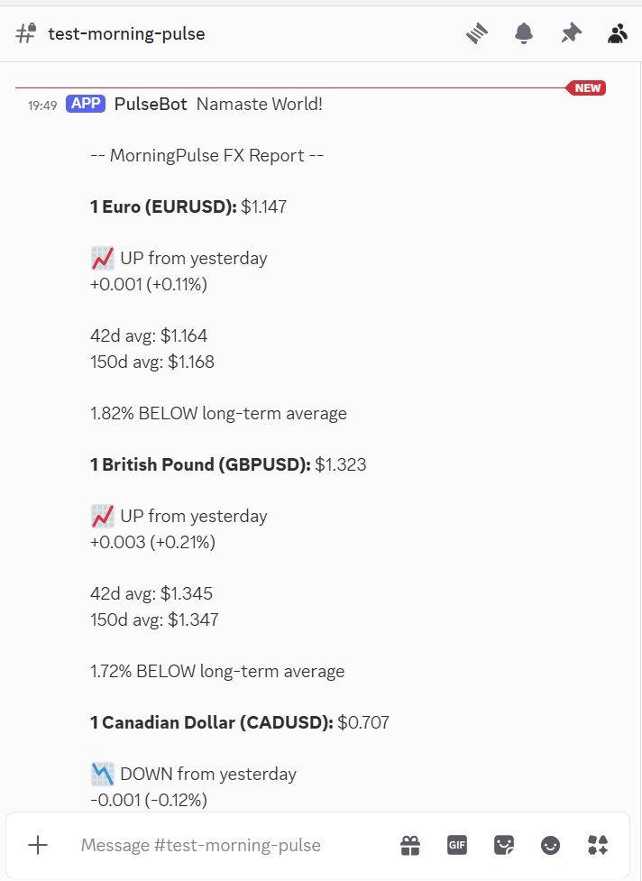
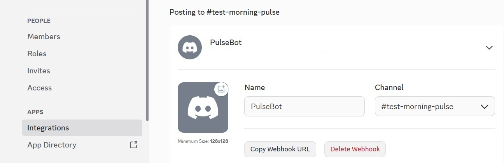
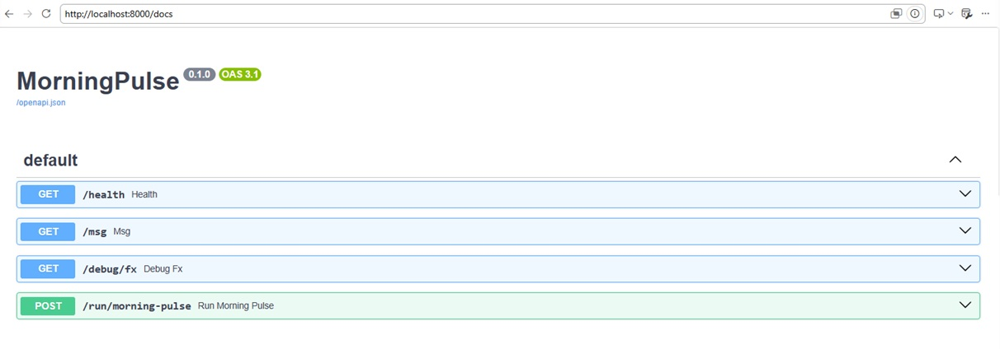

# MorningPulse

MorningPulse is a lightweight, containerized FastAPI service that delivers automated market briefings directly to Discord using webhooks; no Developer account or registered "application" is necessary.

Each morning, MorningPulse gathers foreign exchange market data, calculates daily changes and moving averages, formats a human-readable report, then delivers it to a Discord channel.  

Converted from a legacy project that was one long script. MorningPulse demonstrates:  

- FastAPI service development  
- Docker containerization  
- Environment-based configuration  
- External API integration  
- Discord webhook automation  
- Persistent storage with Docker volumes  
- GitHub Actions CI/CD workflows  

# Current Features

✅ Randomized good morning message in different languages

✅ Daily foreign exchange reports

✅ Historical moving averages

✅ Daily price change calculations

✅ Discord webhook delivery

✅ Persistent cache volume

✅ Dockerized deployment

✅ GitHub Actions automation

# Architecture
FXMarketAPI  
     ↓
 FXProvider  
     ↓
 Market Transform  
     ↓
 Report Builder  
     ↓
 Discord Webhook  

# Example Report

MorningPulse currently reports:

- Euro (EURUSD)  
- British Pound (GBPUSD)  
- Canadian Dollar (CADUSD)  
- Australian Dollar (AUDUSD)  
- New Zealand Dollar (NZDUSD)  
- Japanese Yen (USDJPY)  

Each report includes:

- Current value  
- Direction from previous trading day  
- Daily percentage change  
- Short-term moving average  
- Long-term moving average  
## Example Discord Report




# Requirements
- Docker  
- Docker Compose  
- FXMarketAPI account and API key  
- Discord webhook URL  
- Docker Engine with Compose v2 installed  
  https://docs.docker.com/get-docker/  

Verify:
```
docker --version
docker compose version
```
# Quick Start Options
Project can run in three modes.
Retrieve api key from https://fxmarketapi.com/  
Create and retrieve webhook URL from your Discord channel. Discord -> Edit Channel -> Integrations -> Webhooks

## Example Discord Webhook Integration

  

## 1. GitHub Actions (Scheduled Run)
This project uses GitHub Actions to run the service on a schedule. Go to Action tab and enable the workflow if necessary.

Inject secrets.

- Go to GitHub repository → Settings → Secrets and variables → Actions  
- Add the following secrets:  
  - FOREX_API_KEY 
  - DISCORD_WEBHOOK_URL  
  - MY_NAME # (optional)

The workflow will automatically inject these at runtime.   

## 2. Local Development
Clone the repository and create your environment file:  

```
git clone <repo-url>
cd MorningPulse
cp .env.example .env
```

Configure .env:  

- DISCORD_WEBHOOK_URL=your_webhook_url  
- FOREX_API_KEY=your_api_key
- FOREX_PAIRS=EURUSD,GBPUSD,CADUSD,AUDUSD,NZDUSD,USDJPY # (optional)
- MY_NAME=World # Insert your name (optional)

Build and start the service:  

```
docker compose up --build
```
### Run Manually
You can trigger the endpoint locally:  
```
curl -X POST http://localhost:8000/run/morning-pulse  
```
Or open API docs: http://localhost:8000/docs  

## Example Docs



Or optionally via cron...  

Example 1:
```
0 10 * * * curl -X POST http://localhost:8000/run/morning-pulse
```
Example 2:
```
0 10 * * * docker exec morningpulse curl -X POST localhost:8000/run/morning-pulse
```

## 3. Deployable Service (Optional)
This project’s default GitHub Actions workflow runs the service locally inside the CI runner and triggers it via localhost.  

If you choose to deploy the API externally (VPS, Render, Fly.io, etc.), you can instead configure the workflow to call your deployed endpoint.  

In this case, update the scheduler step:
```
run: curl --fail -X POST https://your-domain.com/run/morning-pulse
```

# API Endpoints
### GET /health

Returns service health information.

### GET /debug/fx

Returns raw foreign exchange data.

### GET /msg

Builds a report without sending it to Discord.

### POST /run/morning-pulse

Builds and sends the report to Discord.

### Data Persistence

Market data is cached using a Docker volume:

./cache

The cache survives container rebuilds and restarts.

# Roadmap
- News Headlines and Summaries  
- Book Quotes/Poetry/Riddle  
- Stock Scanner  
- Discord Embeds  
- Expanded CI/CD  
- Raspberry Pi Deployment Guide  
- Cron Service  
- Weighted 'good morning' messages and facts
